# Dependency Injection

> It’s entirely possible to apply DI without using a DI Container. A DI Container is a helpful, but optional, tool.

## What

_Dependency Injection_ is a set of software design principles and patterns that enables you to develop loosely coupled code.

DI is the opposite of a `Service Locator`. You never have to imperatively ask for Dependencies. Rather, you require consumers to supply them.

## Why

- To write maintainable code
- Testable code
- Open for extensibility for flexible requirements

## How

Example:

```
public interface IMessageWriter
{
    void Write(string message);
}

public class ConsoleMessageWriter : IMessageWriter
{
    public void Write(string message)
    {
        Console.WriteLine(message);
    }
}

public class Salutation
{
    private readonly IMessageWriter writer;

    public Salutation(IMessageWriter writer)    // Provides the Salutation class with the IMessageWriter Dependency using Constructor Injection
    {
        if (writer == null)    // Guard Clause verifies that the supplied IMessageWriter isn’t null
            throw new ArgumentNullException("writer");

        this.writer = writer;
    }

    public void Exclaim()
    {
        this.writer.Write("Hello DI!");    // Sends the Hello DI! message to the IMessageWriter Dependency
    }
}
```

The `Salutation` class depends on a custom interface called `IMessageWriter`. It requests an instance of it through its constructor. This practice is called **Constructor Injection**

DI enables you to swap out `ConsoleMessageWriter` for other classes (even to write to a db if you need to) as long as that class implements `IMessageWriter`.

For example, if you need a new message writer called `SecureMessageWriter`, you can write a new class that implements `IMessageWriter` then inject it into `Salutation`. `Salutation` itself doesn't have to change. That’s _open for extensibility, but closed for modification_.

## What to inject and what not to inject

### **Seams**

Everywhere you decide to program against an Abstraction instead of a concrete type, you introduce a Seam into the application. A _Seam_ is a place where an application is assembled from its constituent parts, similar to the way a piece of clothing is sewn together at its seams.

`Main()` -----create/use ----> `Salutation` ---- _SEAM_ ----> `ConsoleMessageWriter`

This is because the `Salutation` class only programs against `IMessageWriter` - an **abstraction**

Categorize your Dependencies into **Stable Dependencies** and **Volatile Dependencies**

1. **Stable Dependencies**

- Class or module already exists
- New versions don't contain breaking changes
- Deterministic algo
- You expect to never replace, wrap, decorate, or Intercept the class or module with another.

In general, Dependencies can be considered stable by exclusion. They’re stable if they aren’t volatile.

2. **Volatile Dependencies**

- introduces a requirement to set up and configure a runtime environment for the application (example: database)
- doesn’t yet exist, or is still in development.
- isn’t installed on all machines in the development organization
- non-deterministic algo (Random, DateTime.Now, RandomNumberGenerator)

## DI Scope

In DI, a class also loses the ability to

- create its own dependencies (object composition)
- control the lifetime of the object

# Some diagrams

UI layer ----depends on----> Domain layer <----depends on --- Data access layer

Build _outside-in_ starting from the UI so that it becomes clear what we need to implement (YAGNI - don't build extra things)

`ProductService` -------uses-----> `IProductRepository` <|----implemented by ----- `SqlProductRepository`

Abstractions should be owned by the module using the Abstraction. This means that the consuming module has control over the shape of the Abstraction, and it’s distributed with that module, rather than with the module that implements it. (`IProductRepository` is defined in away that benefits `ProductService` the most)

# Composition root

A single, logical location in an application where modules are composed together.

Should take place as close to the entry point as possible

## Using PureDI for Composition Root

The entry point is in the Main method. However, the Main method of an ASP.NET Core application delegates most of the work to the Startup class. This Startup class is close enough to the application’s entry point, and we’ll use that as our Composition Root.

```
public class Startup
{
    public Startup(IConfiguration configuration)
    {
        this.Configuration = configuration;    // ASP net core cals the constructor when the app starts
    }

    public IConfiguration Configuration { get; }

    public void ConfigureServices(    // By convention, ASP.NET calls this method. The supplied IServiceCollection instance lets you influence the default services that ASP.NET knows about.
        IServiceCollection services)
    {
        services.AddMvc();

        services.AddHttpContextAccessor();    // Adds a service to the framework, which retrieves the current HttpContext

        var connectionString =    // Loads the application’s database connection string from the configuration file
            this.Configuration.GetConnectionString(
                "CommerceConnection");

        services.AddSingleton<IControllerActivator>(    // Replaces the default IControllerActivator with one that builds the object graphs
            new CommerceControllerActivator(
                connectionString));
    }

    ...
}
```

To enable wiring MVC controllers to the application, you must employ the appropriate Seam in ASP.NET Core MVC, called an `IControllerActivator`

The `Startup.ConfigureServices` method only runs once. As a result, `CommerceControllerActivator` class is a single instance that’s only initialized once. Because you set up ASP.NET Core MVC with the custom `IControllerActivator`, MVC invokes its Create method to create a new controller instance for each incoming HTTP request

```
public class CommerceControllerActivator : IControllerActivator
{
    private readonly string connectionString;

    public CommerceControllerActivator(string connectionString)
    {
        this.connectionString = connectionString;
    }

    public object Create(ControllerContext ctx)    // ASP.NET Core MVC calls this method for every request.
    {
        Type type = ctx.ActionDescriptor
            .ControllerTypeInfo.AsType();

        if (type == typeof(HomeController))   // Builds the appropriate object graph if MVC asks for a HomeController
        {
            return
                new HomeController(
                    new ProductService(
                        new SqlProductRepository(
                            new CommerceContext(
                                this.connectionString)),
                        new AspNetUserContextAdapter()));
        }
        else
        {
            throw new Exception("Unknown controller.");
        }
    }
}

```

In this example, this is the composition root.

Note how the `Startup` class loads the configuration, and the `CommerceControllerActivator` only depends on the configuration value, not the configuration system. It's best to separate the loading of configuration values from the methods that do Object Composition.

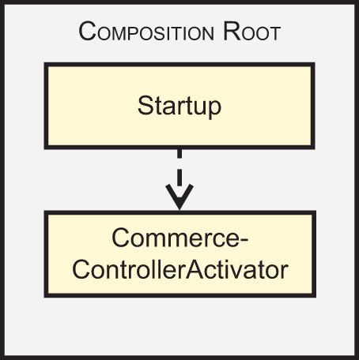

## Using DI Container in a Composition Root

If you use a DI Container, the Composition Root should be the **_only_** place where you use the DI Container

# Constructor Injection

Allows a class to statically declare its required Dependencies by specifying them as parameters to the class’s constructor.

Should be the default choice for DI

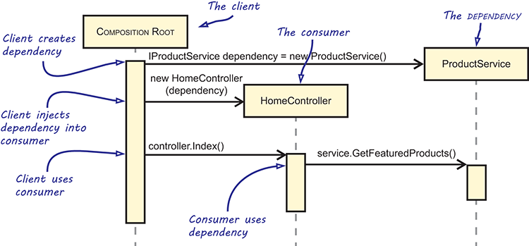

**Note**: Keep the constructor free of any other logic to prevent it from performing any work on Dependencies.

## With Adapter Design Pattern

General structure of the Adapter DP

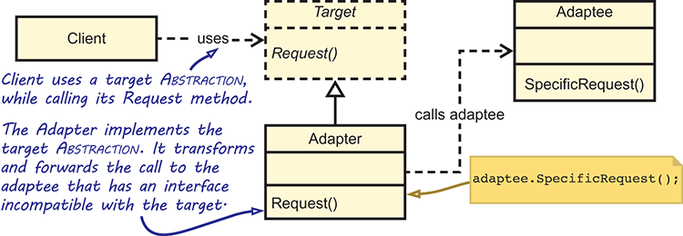

Concrete example of the Adapter DP

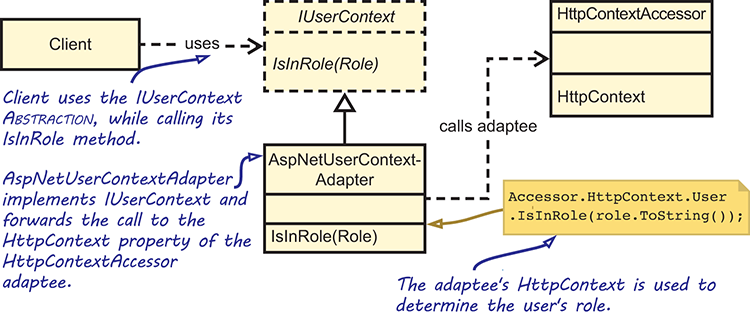

## Interaction between components

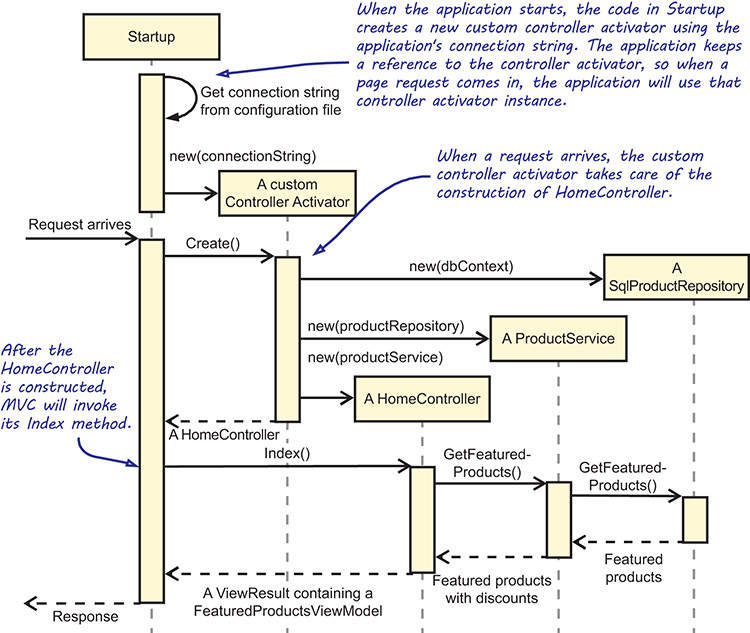

# Method injection

Enables you to provide a Dependency to a consumer when either the Dependency or the consumer might change for each operation.

Method Injection supplies a consumer with a Dependency by passing it as method argument on a method called outside the Composition Root.

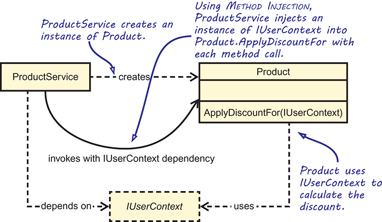

## When to use

- When the consumer of the injected Dependency varies on each call
- When the injected Dependency varies on each call to a consumer

Unsuitable when used within the Composition Root

## Example

### **1. When the consumer varies**

```
public class Customer
{
    public Guid Id { get; private set; }
    public string Name { get; private set; }

    public Customer(Guid id, string name)
    {
        ...
    }

    public void RedeemVoucher(
        Voucher voucher,
        IVoucherRedemptionService service)
    {
        if (voucher == null)
            throw new ArgumentNullException("voucher");
        if (service == null)
            throw new ArgumentNullException("service");

        service.ApplyRedemptionForCustomer(
            voucher,
            this.Id);
    }

    public void MakePreferred(IEventHandler handler)
    {
        if (handler == null)
            throw new ArgumentNullException("handler");

        handler.Publish(new CustomerMadePreferred(this.Id));
    }
}
```

Inside a `CustomerServices` component, the `Customer`'s `RedeemVoucher` method can be called while passing the `IVoucherRedemptionService` Dependency with the call

```
public class CustomerServices : ICustomerServices
{
    private readonly ICustomerRepository repository;
    private readonly IVoucherRedemptionService service;

    public CustomerServices(    // Constructor Injection
        ICustomerRepository repository,
        IVoucherRedemptionService service)
    {
        this.repository = repository;
        this.service = service;
    }

    public void RedeemVoucher(
        Guid customerId, Voucher voucher)
    {
        var customer =
            this.repository.GetById(customerId);

        customer.RedeemVoucher(voucher, this.service);    // Passing IVoucherRedemptionService

        this.repository.Save(customer);
    }
}
```

In the example, only a single `Customer` instance is requested from `ICustomerRepository`. But a single `CustomerServices` instance can be called over and over again using a multitude of customers and vouchers, causing the same `IVoucherRedemptionService` to be supplied to many different `Customer` instances. `Customer` is the consumer of the `IVoucherRedemptionService` Dependency and, while you’re reusing the Dependency, you’re varying the consumer.

```
public Bitmap ApplyEffects(Bitmap source)
{
    if (source == null) throw new ArgumentNullException("source");

    Bitmap result = source;

    foreach (IImageEffectAddIn effect in this.effects)
    {
        result = effect.Apply(result, this.context);
    }

    return result;
}
```

### **2. When the dependency varies**

```
public interface IImageEffectAddIn
{
    Bitmap Apply(
        Bitmap source,
        IApplicationContext context);    // Provides contextual information to the image effect by the graphical application using Method Injection
}
```

The `IImageEffectAddIn`'s `IApplicationContext` Dependency can vary with each call to the Apply method, providing the effect with information about the context in which the operation is being invoked. Some implementations may not care about the context at all, whereas other implementations will.

# Property injection

Allows clients to optionally override some class’s default behavior

Similar to `Constructor Injection`, is applied within `Composition root`. Allows you to override a class' local default. Also known as `Setter Injection`

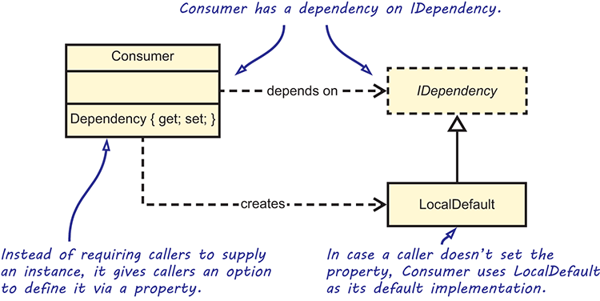

```
public class Consumer
{
    public IDependency Dependency { get; set; }
}
```

## When
Should _only_ be used when the class has a good local default but you still want to enable callers to provide different implementations of the dependency.

Should _only_ be used for ***optional*** dependencies.

Rarely used in applications (sometimes used in reusable libraries)

# Choosing which pattern to use
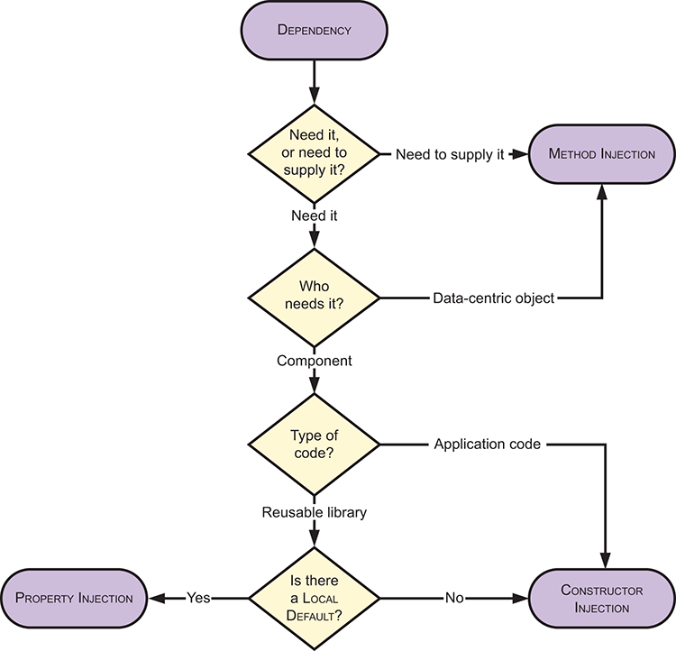


# Code smells

## Constructor Overinjection

```
public OrderService(
    IOrderRepository orderRepository, // Update the order
    IMessageService messageService,   // Send receipt
    IBillingSystem billingSystem,     // Notify accounting system
    ILocationService locationService, // Select best warehouse and ship order
    IInventoryManagement inventoryManagement) // Ask the warehouse to ship
{
    this.orderRepository = orderRepository;
    this.messageService = messageService;
    this.billingSystem = billingSystem;
    this.locationService = locationService;
    this.inventoryManagement = inventoryManagement;
}

public void ApproveOrder(Order order)
{
    this.UpdateOrder(order);
    this.Notify(order);
}

private void UpdateOrder(Order order)
{
    order.Approve();
    this.orderRepository.Save(order);
}

private void Notify(Order order)
{
    this.messageService.SendReceipt(new OrderReceipt { ... });
    this.billingSystem.NotifyAccounting(...);
    this.Fulfill(order);
}

private void Fulfill(Order order)
{
    this.locationService.FindWarehouses(...);
    this.inventoryManagement.NotifyWarehouses(...);
}

```

**Threshold**: 4 constructor arguments MAX

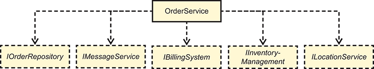

`OrderService` has five direct Dependencies, which suggests an SRP violation. On the other hand, all of these Dependencies are required because the `OrderService` class must implement all of the desired functionality when it receives a new order. You can address this issue by redesigning `OrderService` using Facade Services refactoring.

Two common approaches to refactor:

1. **Facade Service**
   A `Facade Service` hides a natural cluster of interacting Dependencies, along with their behavior, behind a single Abstraction.

When redesigning `OrderService`, the first thing to do is to look for natural clusters of interaction. The interaction between `ILocationService` and `IInventoryManagement` should immediately draw attention, because they are used to find the closest warehouses that can fulfill the order.

These two can be extracted into `IOrderFulfillment`

```
public class OrderFulfillment : IOrderFulfillment
{
    private readonly ILocationService locationService;
    private readonly IInventoryManagement inventoryManagement;

    public OrderFulfillment(
        ILocationService locationService,
        IInventoryManagement inventoryManagement)
    {
        this.locationService = locationService;
        this.inventoryManagement = inventoryManagement;
    }

    public void Fulfill(Order order)
    {
        this.locationService.FindWarehouses(...);
        this.inventoryManagement.NotifyWarehouses(...);
    }
}

```

As a further benefit, you’ve encapsulated the algorithm for finding the best warehouse for a given order into a reusable component.

The next thing to notice is that all the requirements involve notifying other systems about the order (`IMessageService`, `IBillingSystem`, even the refactored `IOrderFulFillment`). This can be extracted into an interface:

```
public interface INotificationService
{
    void OrderApproved(Order order);
}
```

Each notification to an external system implement this interface. Because all three notifications implement the same interface, you can wrap them in a `Composite` pattern.

```
public class CompositeNotificationService
    : INotificationService
{
    IEnumerable<INotificationService> services;

    public CompositeNotificationService(
        IEnumerable<INotificationService> services) // Wrap a sequence of services
    {
        this.services = services;
    }

    public void OrderApproved(Order order)
    {
        foreach (var service in this.services)
        {
            service.OrderApproved(order); // Forward calls to all services
        }
    }
}
```

This means `OrderService` can depend on a single `INotificationService`

```
public class OrderService : IOrderService
{
    private readonly IOrderRepository orderRepository;
    private readonly INotificationService notificationService;

    public OrderService(
        IOrderRepository orderRepository,
        INotificationService notificationService)
    {
        this.orderRepository = orderRepository;
        this.notificationService = notificationService;
    }

    public void ApproveOrder(Order order)
    {
        this.UpdateOrder(order);

        this.notificationService.OrderApproved(order);
    }

    private void UpdateOrder(Order order)
    {
        order.Approve();
        this.orderRepository.Save(order);
    }
}
```

Refactored `Composite Root`

```
var repository = new SqlOrderRepository(connectionString);

var notificationService = new CompositeNotificationService(
    new INotificationService[]
    {
        new OrderApprovedReceiptSender(messageService),
        new AccountingNotifier(billingSystem),
        new OrderFulfillment(locationService, inventoryManagement)
    });

var orderServive = new OrderService(repository, notificationService);
```

**Lam's note**: Mark says "At a high level, you don’t need to care about the details of how OrderService notifies other systems, but you do care that it does.".
My knee-jerk reaction was that it's a dangerous place to be. I was afraid of a micro distributed system where everything is a mystery. However, upon further examination, I've changed my view. I think what Mark says is true. Does this make it hard to understand the system? Not necessarily. _If_ the system was designed correctly, we know that dependencies are only resolved at the `Composite Root` and we can look there to see the details of the services. I think some new classes were also created (`OrderApprovedReceiptSender` and `AccountingNotifier`) to implement the `INotificationService`.

_The key is to identify natural clusters of interaction._

2. **Domain Event**
   The `INotificationService` can quickly go out of hand like this

```
public interface INotificationService
{
    void OrderApproved(Order order);
    void OrderCancelled(Order order);
    void OrderShipped(Order order);
    void OrderDelivered(Order order);
    void CustomerCreated(Customer customer);
    void CustomerMadePreferred(Customer customer);
}
```

Each method represents a domain event. Abstractions with many members, however, typically violate the Interface Segregation Principle ("No client should be forced to depend on methods it doesn’t use.")
With each change to this interface, all implementations of that interface must be updated too, causing ever growing implementation.
We can promote the domain events to actual types and make them part of the domain, making an interesting opportunity to generalize even further arise.

```
public class OrderApproved
{
    public readonly Guid OrderId;

    public OrderApproved(Guid orderId)
    {
        this.OrderId = orderId;
    }
}

public class OrderCancelled
{
    public readonly Guid OrderId;

    public OrderCancelled(Guid orderId)
    {
        this.OrderId = orderId;
    }
}
```

When each domain event in your system gets its own type, it lets you change INotificationService to a generic interface with a single method

```
public interface IEventHandler<TEvent>    // changed the name from INotificationService to IEventHandler
{
    void Handle(TEvent e);
}
```

The new `OrderFulfillment` class

```
public class OrderFulfillment
    : IEventHandler<OrderApproved>
{
    private readonly ILocationService locationService;
    private readonly IInventoryManagement inventoryManagement;

    public OrderFulfillment(
        ILocationService locationService,
        IInventoryManagement inventoryManagement)
    {
        this.locationService = locationService;
        this.inventoryManagement = inventoryManagement;
    }

    public void Handle(OrderApproved e)
    {
        this.locationService.FindWarehouses(...);
        this.inventoryManagement.NotifyWarehouses(...);
    }
}
```

```
public class CompositeEventHandler<TEvent> : IEventHandler<TEvent>
{
    private readonly IEnumerable<IEventHandler<TEvent>> handlers;

    public CompositeEventHandler(
        IEnumerable<IEventHandler<TEvent>> handlers)
    {
        this.handlers = handlers;
    }

    public void Handle(TEvent e)
    {
        foreach (var handler in this.handlers)
        {
            handler.Handle(e);
        }
    }
}
```

```
public class OrderService : IOrderService
{
    private readonly IOrderRepository orderRepository;
    private readonly IEventHandler<OrderApproved> handler;

    public OrderService(
        IOrderRepository orderRepository,
        IEventHandler<OrderApproved> handler)
    {
        this.orderRepository = orderRepository;
        this.handler = handler;
    }

    public void ApproveOrder(Order order)
    {
        this.UpdateOrder(order);

        this.handler.Handle(
            new OrderApproved(order.Id));    // Create a domain event here to handle
    }
    ...
}
```

```
var repository = new SqlOrderRepository(connectionString);

var orderApprovedHandler = new CompositeEventHandler<OrderApproved>(
    new IEventHandler<OrderApproved>[]
    {
        new OrderApprovedReceiptSender(messageService),
        new AccountingNotifier(billingSystem),
        new OrderFulfillment(locationService, inventoryManagement)
    });

var orderServive = new OrderService(repository, orderApprovedHandler);
```

## Leaky Abstraction

When you extract an interface from a concrete type, but some of the parameters or return types are still concrete types defined from the library you want to abstract from.

```
public interface IRequestContext    // Abstract away from ASP.NET env
{
    HttpContext Context { get; }    // Still exposing HttpContext which is a part of ASP.NET
}
```

You need to ensure that all types exposed by the root interface are themselves interfaces (except behaviourless data objects such as view models, DTO).

That said, returning all interfaces still doesn't mean you're safe from leaky abstraction. You have to look at what the consumer wants to achieve. For instance, if a consumer needs to find out the role of the user who sent the current web request, `IUserContext` interface doesn’t reveal to the consumer that it’s running as part of an ASP.NET web application.

```
public interface IUserContext
{
    bool IsInRole(Role role);
}
```

**Abstractions that implement IDisposable are Leaky Abstractions**. Application code shouldn’t be responsible for the management of the lifetime of objects (should be in Composition Root instead).

**Lam's note**: Talk to peeps about the proxy part of chapter 6. Why can't we new `SqlProductRepository` directly without a Proxy?

## Cyclic dependencies

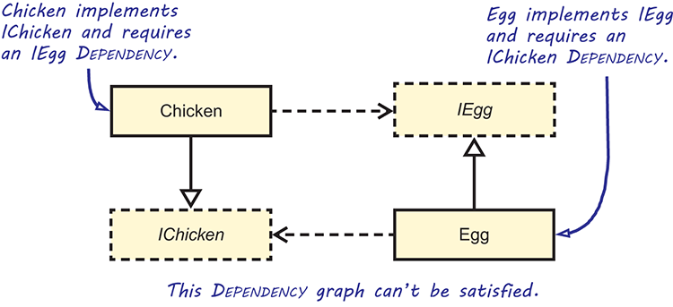

```
public class Chicken : IChicken
{
    public Chicken(IEgg egg) { ... }

    public void HatchEgg() { ... }
}

public class Egg : IEgg
{
    public Egg(IChicken chicken) { ... }
}
```
Dependency cycles are typically caused by an SRP violation.

### Strategies to fix
- Split classes: split a big class into smaller classes 
- .NET event: raise events instead of directly invoke another class
- Property injection: should be the last ditch effort

## Temporal Coupling

Occurs when there's an implicit relationship between two or more members of a class, requiring clients to invoke one member before the other

Example: `Initialize` methods
```
public class Component
{
    private ISomeInterface dependency;

    public void Initialize(     
        ISomeInterface dependency)    
    {
        this.dependency = dependency;
    }

    public void DoSomething()
    {
        if (this.dependency == null)    
            throw new InvalidOperationException(    
                "Call Initialize first.");     

        this.dependency.DoStuff();
    }
}
```
`Initialize` and `DoSomething` methods need to be invoked in a particular order, but this relationship is implicit.

**Solution**: Apply `Constructor Injection`

**Note**: `Constuctor Injection` should be primarily used when building applications, `Method Injection` frameworks. (not a rule as MI can be useful in applications too: ***optional*** dependencies)

# DI anti-patterns
## Control freak
As opposed to IoC, dependencies are controlled directly
```
public class HomeController : Controller
{
    public ViewResult Index()
    {
        var service = new ProductService();    // Create a new instance of a volatile dependancy, causing tightly coupled code

        var products = service.GetFeaturedProducts();
        return this.View(products);
    }
}
```

Be wary of factory methods

### Control freak through overloaded constructors
An all-too-common anti-pattern defines a test-specific constructor overload that allows you to explicitly define a Dependency, although the production code uses a parameterless constructor
```
private readonly IProductRepository repository;

public ProductService()      
    : this(new SqlProductRepository())      // parameterless constructor forwards the foreign default to the overloaded constructor
{      
}      

public ProductService(IProductRepository repository)      
{      
    if (repository == null)      
        throw new ArgumentNullException("repository");      
      
    this.repository = repository;      
}      
```

This allows unit testing but still promotes tightly coupled codes

**Foreign default**: an implementation of a Volatile Dependency that’s used as a default, even though it’s defined in a different module than its consumer

## Service Locator
An implicit service to server dependencies to customers but isn't guaranteed to do so. Supplies application components outside the Composition Root with access to an unbounded set of Volatile Dependencies.
```
public class HomeController : Controller
{
    public HomeController() { }      // Parameterless constructor

    public ViewResult Index()
    {
        IProductService service =
            Locator.GetService<IProductService>();      // request the service w a static Locator class

        var products = service.GetFeaturedProducts();      

        return this.View(products);
    }
}
```
Asking a container or locator to resolve a complete object graph from the Composition Root is proper usage. Asking it for granular services from anywhere else but the Composition Root implies the Service Locator anti-pattern. 

```
public static class Locator
{
    private static Dictionary<Type, object> services =      
        new Dictionary<Type, object>(); // internal dictionary that maps abstract types to concrete instances

    public static void Register<T>(T service) // register service before using
    {
        services[typeof(T)] = service;
    }

    public static T GetService<T>()      // Resolve arbitrary abstraction
    {   
        return (T)services[typeof(T)];     
    }

    public static void Reset() // reset the services (for unit testing)
    {
        services.Clear();
    }
}
```
Classes rely on the service to be available in the `Service Locator`, so it’s important that it’s previously configured. 

### **Negative effects of Service Locator**
- Classes now depend on both the `Service Locator` and the dependencies
- It's non obvious what the dependencies for the class are
- Interdependent tests (you need to remember to call reset() after every test)
- `GetService<T>` will accept any type and compile but might throw exceptions at runtime

## Ambient Context
Makes a single dependency available through a static accessor

Supplies application code outside the Composition Root with global access to a Volatile Dependency or its behavior by the use of static class members.
```
public string GetWelcomeMessage()
{
    ITimeProvider provider = TimeProvider.Current;      
    DateTime now = provider.Now;

    string partOfDay = now.Hour < 6 ? "night" : "day";

    return string.Format("Good {0}.", partOfDay);
}
```
Ambient Context allows its Dependency to be changed, whereas the Singleton pattern ensures that its singular instance never changes. That said, the Singleton pattern should only be used either from within the Composition Root or when the Dependency is Stable.
### Ambience context when logging
```
public class MessageGenerator
{
    private static readonly ILog Logger =
        LogManager.GetLogger(typeof(MessageGenerator));  // this hides dependency and makes it hard to test 

    public string GetWelcomeMessage()
    {
        Logger.Info("GetWelcomeMessage called.");      

        return string.Format(
            "Hello. Current time is: {0}.", DateTime.Now);
    }
}
```
## Constrained Construction
Constructors are assumed to have a particular signature (with ath goal of enabling late binding)

# Decorator pattern
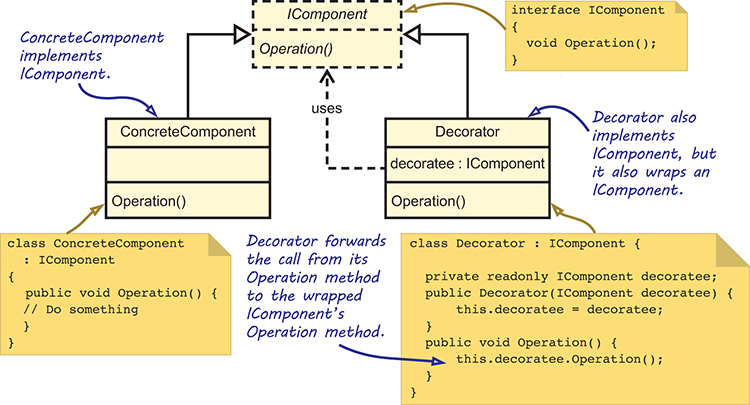

A Decorator can wrap another Decorator, which wraps another Decorator, and so on

```
public interface IGreeter{    
    string Greet(string name);
}

public class FormalGreeter : IGreeter
{
    public string Greet(string name)
    {
        return "Hello, " + name + ".";
    }
}

public class SimpleDecorator : IGreeter      
{
    private readonly IGreeter decoratee;      

    public SimpleDecorator(IGreeter decoratee)
    {
        this.decoratee = decoratee;
    }

    public string Greet(string name)
    {
        return this.decoratee.Greet(name);      
    }
}
```
The wrapped object implements the same Abstraction as the Decorator. This enables a Composer to replace the original component with a Decorator without changing the consumer.The wrapped object is often injected into the Decorator declared as the abstract type (interface and not the concrete implementation)

# Cross-cutting concern

Using Decorator pattern to implement Auditing (a cross cutting concern)

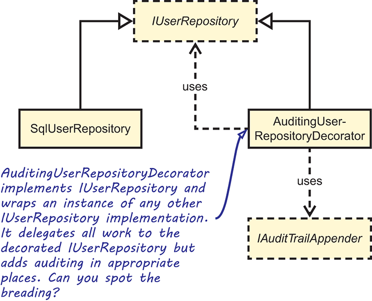

Note how only the update operation gets audited. This is because most of the time, only CUD operations are audited (ignoring read operations).

```
public class AuditingUserRepositoryDecorator
    : IUserRepository      
{
    private readonly IAuditTrailAppender appender;
    private readonly IUserRepository decoratee;

    public AuditingProductRepository(
        IAuditTrailAppender appender,
        IUserRepository decoratee)      
    {
        this.appender = appender;
        this.decoratee = decoratee;
    }
    public User GetById(Guid id)      
    {      
        return this.decoratee.GetById(id);      
    }      

    public void Update(User user)      
    {      
        this.decoratee.Update(user);      
        this.appender.Append(user);      
    }      
}
```

# Tips

Runtime data that describes contextual information is best hidden behind an Abstraction and injected into a consumer
