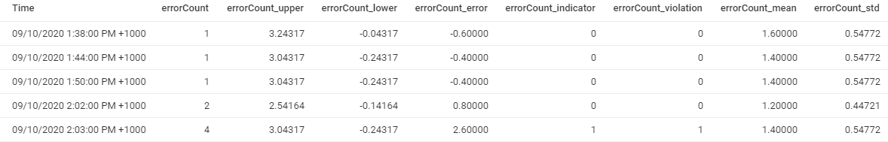
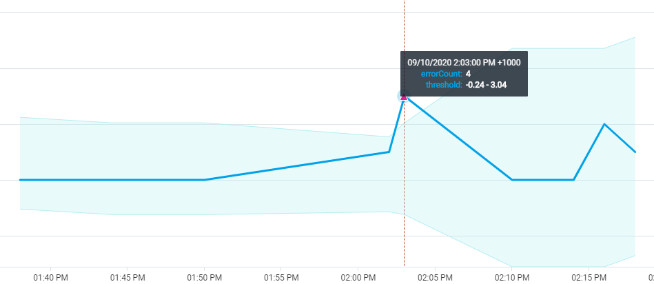
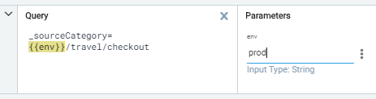

# Sumologic

This is the note for the Fundamentals Cert and Advanced Search Mastery

## Metadata

| Tag             | Description                                 |
|-----------------|---------------------------------------------|
| _collector      | Name of collector (default to hostname)     |
| _sourceHost     | Hostname of server                          |
| _sourceName     | Name and Path of log file                   |
| _source         | Name of the data source                     |
| _sourceCategory | **Can be configured. Main data tag.**       |

## Operators

### Logreduce

`_sourceCategory=prod/travel/checkout | logreduce`

Sumologic will find a pattern in logs and group the logs together according to the pattern. It will order the result from most frequent to least frequent (count).

When looking for an error, it might be helpful to order the result of `logreduce` by least frequent (errors will be less frequent than normal information or successful logs)

### Logcompare

Compare the logcompare today with logs some time in the past. This tells us if there's an increase or decrease in something.

`_sourceCategory=blah | logcompare timeshift -24h`

Example 2: 

`_sourceCategory=blah | logcompare timeshift -24h | where (_isNew)`

Only show the logs that are new compared to 24h ago

### Parse

#### Regex

Parse log messages to extract fields based on a regex

`_sourceCategory=blah | parse regex "(?<field_name>regex)"`

Example

This regex extract anything with a pattern of 4 numbers (with 1-3 number letters ex: 1.123.0.456) separated by `.` into a field called `ip_address`

`_sourceCategory=prod/travel/checkout | parse regex "(?<ip_address>\d{1,3}\.\d{1,3}\.\d{1,3}\.\d{1,3})"`

#### UI

Highlight the whole part you want to parse, click Parse Text

### Count by

Aggregate the logs messages and count them grouped by a field

`_sourceCategory=blah | count by <field>`

Example: Count all the status code for a component

`_sourceCategory=blah | json "ResponseCode" as responseCode | count by responseCode`

| responseCode | _count |
|--------------|--------|
| 200          | 1000   |
| 400          | 50     |
| 500          | 20     |

### Count

Return a count of a field (doesn't group by anything)

Example:

`_sourceCategory= blah | json "ResponseCode" as responseCode | where !(responseCode = 200 or responseCode = 201) | count(responseCode)`

| _count |
|--------|
| 13     |

`_sourceCategory= blah | json "ResponseCode" as responseCode | where !(responseCode = 200 or responseCode = 201) | count by responseCode `

| responseCode | _count |
|--------------|--------|
| 404          | 7      |
| 500          | 6      |

### Timeslice

Divide the result into time periods. Example: `timeslice 1m` : get the logs and slice it into 1m time periods. Remember to include `_timeslice` in the count by section

Example: Count all the status code in 1m time periods

`_sourceCategory=blah | json "ResponseCode" as responseCode | timeslice 1m | count by _timeslice, responseCode`

Result for this query together with `order by` is displayed in the next section

### Order by

Note: You can just click the `Time` col in the result and it will be ordered for you.

Example: Count all the status code in 1m time periods but order them by time

`_sourceCategory=blah | json "ResponseCode" as responseCode | timeslice 1m | count by _timeslice, responseCode | order by _timeslice asc`

The result will be

| Time | responseCode | _count |
|------|--------------|--------|
| 8:50 | 200          | 100    |
| 8:51 | 200          | 900    |
| 8:52 | 400          | 10     |
| 8:53 | 200          | 20     |

### Transpose

Display the data in a different format (excel-like) with columns and rows.

Example: Display the all status code in 1m time period

`_sourceCategory=blah | json "ResponseCode" as responseCode | timeslice 1m | count by _timeslice, responseCode | order by _timeslice asc | transpose row _timeslice column responseCode`

| Time | 200 | 400 | 404 | 500 |
|------|-----|-----|-----|-----|
| 8:50 | 120 | 100 | 10  | 2   |
| 8:51 | 354 | 10  | 4   | 1   |
| 8:52 | 130 | 10  | 7   | 8   |
| 8:53 | 140 | 20  | 5   | 1   |

Note: This is pretty good to turn into a line chart or a bar chart.

### Where

Define condition to include or exclude result

Example: Count all the status code that is NOT 200 or 201

`_sourceCategory=blah | json "ResponseCode" as responseCode | where (responseCode != 200 and responseCode != 201) | count by responseCode `

or

`_sourceCategory=blah | json "ResponseCode" as responseCode | where !(responseCode = 200 or responseCode = 201) | count by responseCode `

### Outlier

Find an outlier.

Example: If your system usually has some errors, you want to know if the number of error is unusual or not

` json "ResponseCode" as responseCode | timeslice 1m | where !(responseCode = 200 or responseCode = 201) | count(responseCode) as errorCount by _timeslice | outlier errorCount window=10, consecutive=1, threshold=3, direction=+-`

In a line chart view:

- The bluish cloud is the threshold zone
- The dark blue line is the actual count of the response code
- The red triangle is the outlier. In this example we see at 2:04PM there are 4 error response code, which is more than usual

Note:

- Can create an alert for this if you want.
- You can tweak the math to find the outliers. Play around with the values to find what's suitable for the system

### Compare with

Compare data with the data at a point in the past

Example: Compare the number of success status code today and yesterday

`_sourceCategory=blah | json "ResponseCode" as responseCode | where (responseCode = 200 or responseCode = 201) |  count by responseCode  | compare with timeshift -1d`

| responseCode | _count | _count_1d |
|--------------|--------|-----------|
| 200          | 1000   | 1200      |
| 201          | 850    | 800       |

## Parameters

You can have parameters in your search

`_sourceCategory={{env}}/travel/checkout`

where `env` can be either `test`, `uat`, `prod`

