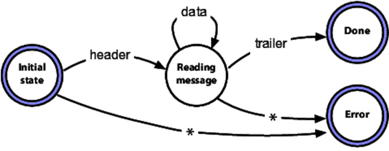
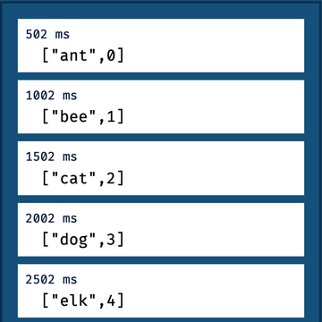
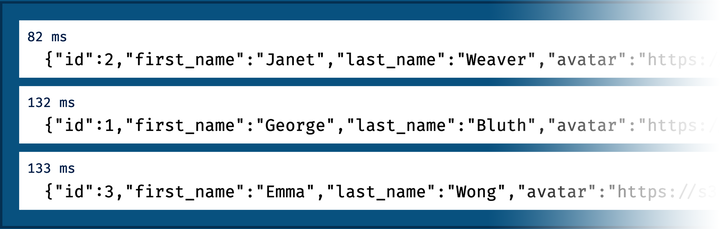
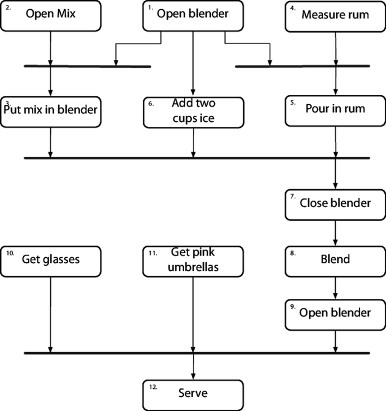

# The pragmatic programmer

Continuous small improvements every day

## 1. You have agency

If your work environment suck and your job is boring, TRY TO FIX IT YOURSELF. But if that doesn't work out, go to a different company.

Make time to study new stuff that looks interesting.

Be proactive and take the opportunities

## 2. Provide options, don't make lame excuses

Team trust is important. You should be able to trust and rely on your team and vice versa.

When you _do_ agree to take on some responsibilities, hold yourself accountable for them.

Don't say something can't be done, explain what _can_ be done to salvage the situtation.

## 3. Software entropy

Fix software rot as soon as it's discovered. If there's no time, do something to show that you're on top of the situation (comment out the code, sub dummy data, etc.)

Neglect _accelerates_ software rot.

### Remember the big picture

Software entropy happens gradually, so you might not notice it. Constantly review what's happening around you, not just what you're personally doing.

## 4. Be a catalyst for change

When you're in a situation where you know what needs to be done but it's hard to get approval to start a project (time, budget, etc.), work out what you _can_ reasonably ask for. 

For example, a few days to work on a concept, develop it well, then show people. Wait for them to ask for the functionality you originally wanted.

## 5. Good enough software

Involve the user in the trade off

Make quality a requirements (users would rather use software with rough edges than wait for a year)

Don't spoil a perfectly good program by overembellishment and overrefinement

## 6. Invest regularly on your knowledge portfolio

Manage this portfolio like you want to FIRE

- **Invest regularly**

Use a consistent time and place

Set up goals

    - Learn at least one new language every year
    - Read a technical book each month
    - Read non-technical books too
    - Take classes
    - Participate in local meetups and events
    - Experiment with envs (try Linux if you've only worked w Win)
    - Stay current

- **Diversify**

The more tech you're comfortable with, the better you'll be able to adjust to change. Don't forget the non-technical skills

- **Manage risk**

Don't put all your technical eggs in one basket

- **Review and balance**

### Opportunities for learning

If you don't know something, find the answer, ask around, find out who can answer the question.

### Critical thinking

Analyse what you read and hear.
Ask why at least 5 times to dig deeper
Who does this benefit?
Find out the context (the prerequisites, the consequences, short and long term)
What will happen next? What wil happen after that?
Why is this a problem?

## 7. Communicate

- Understand the needs, interests, and capabilities of your audience
- Plan what you want to say, write an outline, ask yourself if it commmunicates what you want to say. Refine
- Ask youself: is this a good time to talk about ...?
- Choose the style of delivery that suits the audience
- Make it look good
- Get your audience's feedback early
- Get back to people
- Document everything  

## 8. Good design is easier to change than bad design

_Did the thing I just did make the system easier or harder to change?_

If you don't know the answer to that question:
- Try to make what you write replaceable.
- Note down the situation so that later when you need to change the code, you will be able to look back

## 9. DRY

It's not just about copy-paste code but about duplicate knowledge.

If you want ot chagne something and find yourself having to make changes in diffrent places and possibly in different formats (code, database schema,structure etc.), your code isn't DRY

Not all code duplication is knowledge duplication

Example:

DRY violation in data:

```
class​ Line {
​ 	  Point  start;
​ 	  Point  end;
​ 	  ​double​ length;
​ 	};
```

There's a duplication here: the length is defined by start and end points. Change 1 point and the length changes. It's better to make length a calculated field

```
class​ Line {
​ 	  Point  start;
​ 	  Point  end;
​ 	  ​double​ length { ​return​ start.distanceTo(end); }
​ 	};
```

Later on, you might want to set length as a field to cache the value and avoid expensive computation. They trick is to not expose this to the outside world.

```
​ 	​class​ Line {
​ 	  ​private​ ​double​ length;
​ 	  ​private​ Point  start;
​ 	  ​private​ Point  end;
​ 	
​ 	  ​public​ Line(Point start, Point end) {
​ 	    ​this​.start = start;
​ 	    ​this​.end   = end;
​ 	    calculateLength();
​ 	  }
​ 	
​ 	  ​// public​
​ 	  ​void​ setStart(Point p) { ​this​.start = p; calculateLength(); }
​ 	  ​void​ setEnd(Point p)   { ​this​.end   = p; calculateLength(); }
​ 	
​ 	  Point getStart()       { ​return​ start; }
​ 	  Point getEnd()         { ​return​ end;   }
​ 	
​ 	  ​double​ getLength()     { ​return​ length; }
​ 	
​ 	  ​private​ ​void​ calculateLength() {
​ 	    ​this​.length  = start.distanceTo(end);
​ 	  }
​ 	};
```

### Representational duplication

Your code interfaces with other libs (APIs), external sources, etc. The duplicaito nhere is that two things (your code and the external entity) have knowledge of the representation of the interface(schema, error code). Change one and it breaks the other.

Strategies to mitigate:

1. Look for tools that specifies the APi in a neutral format (mock APIs, functional tests, etc.)
2. Public API are documented using OpenAPI. Import the API spec into the local API tools ato integrate more reliably. If you can't find one, consider creating one and publishing it

## 10. Orthogonality - Decoupling

Eliminate effects between two unrelated things

Ask yourself _If I dramatically change the requirements behind a particular function, how many modules are affected?_

Avoid global data

Avoid similar functions: duplicate code is a symption of structural problems. (look at the Strategy pattern for a better implementation)

## 11. Reversibility

Keep your code flexible, as well as, architecture, deployment, and vendor integration

## 12. End to end system

Look for the important requirements, the ones that define the system, where you have doubts, the biggest risks. Code them first.

Do the MVP

## 13. Prototype to learn

Prototype anything that carries risks.

Protoypes gloss over details and focus in on specific aspects of the system

Make it clear that the prototype won't be productionize

## 14. Domain languages

## 15. Estimate to avoid surprises

First question to ask yourself: do they need high accuracy, or just a ballpark figure?

Choose the units that reflects what you want to convey (People will expect an estimate of 130 days to be accurate, whereas an estimate of 6 months can either be 5 or 7 months)

Think about the scope: _Assuming no traffic, I'll arrive in 20'_

Build a model of the system - Often it can also lads to discoveries of underlying patterns and processes. 

Break the model into components - Discover how the components interact

Record your estimates so you can see how close you were

Iterate the Schedule with the Code

**Estimate project schedules**

Give a range of scenarios

- Optimistic
- Most likely
- Pessimistic

## 16. Keep knowledge understandable to humans


```
<SOCIAL-SECURITY-NO>123-45-6789</SOCIAL-SECURITY-NO>
```

is better than

```
<FIELD10>123-45-6789</FIELD10>
```

or 

```
AC27123456789B11P
```

## 17. Shell games

Master your shell

- Simplify your workflow by aliases and functions

` alias apt-up='sudo apt-get update && sudo apt-get upgrade'`

## 18.  Power editing

Keyboard shortcuts cheatsheet in vscode: Ctrl K + Ctrl S

**Challenges**

- When editing text, move and make selections by character,word, line, and paragraph.
- When editing code, move by various syntactic units (matchingdelimiters, functions, modules, …).
- Reindent code following changes.Comment and uncomment blocks of code with a single command.
- Undo and redo changes.Split the editor window into multiple panels, and navigate between them.
- Navigate to a particular line number.
- Sort selected lines.
- Search for both strings and regular expressions, and repeat previous searches.
- Temporarily create multiple cursors based on a selection or on a pattern match, and edit the text at each in parallel.
- Display compilation errors in the current project.
- Run the current project’s tests.

No one is expecting you to know all of this. Pick and learn the ones that will make your life easier.

Ditch the mouse for a week and only edit with your keyboard. Note down what shortcuts you learn by pen and patper. Use repetition.

## 19. Use version control

Always use it

## 20. Debugging

Fix the problem. It doesn't matter if the bug is your fault, or someone else's. It's still your problem.

**A debugging mindset**

- Don't panic.
- Resist the urge to fix the symptoms. It's more likely that the actual fault is something else, and may involve a number of other related things.
- Always try to discover the root cause of the problem
- Rubber ducking
- Process of elimination
- Don't assume anything. Prove it. 
- When you come across a surprise bug, beyond merely fixing it, you need to determine why this failure wasn't caught earlier. Consider whether you need to amend the unit or the other tests so that they would have caught it.
- Are there any other places that might be susceptible to the same bug?


**Where to start**

- Before starting to look at the bug, make sure you are woking on code that built cleanly
- Reproduce bugs
- Fail test before fixing code 
- Jot down what you find

**Binary chop**

The code working a week ago suddenly fails and you want to find the commit that cause the error.

- Create a test that fails the current version
- Choose a half point between the current release and the last working version, run the tests. 
- Continue on until you can narrow it down.

## 21. Text manipulation

Learn text manipulation: `sed` and `awk` are powerful. Python and Ruby are also good candidates.

## 22. Engineering daybooks

Try journaling on what you're working on. Leave reminders, etc. Try using paper and not a file.

## 23. Design by contract

- Preconditions: what must be true for the routine to be called
- Postconditions
- Class invariants: conditions that will always be true from the perspective of the caller.

Be strict in what you will accept before you begin, and promise as little as possible in return

Enumerate what the input domain range is, the boundary conditions, and what the function promises to deliver, and what it *doesn't* promise to deliver before you write the code.

You can put the contract in the unit tests.

## 24. Crash early

You might feel tempted to catch exceptions to log something then rethrow it like below

```
try {
    DoSomething();
} catch (ExceptionA a) {
    Logger.Log("Exception A");
    throw;
} catch (ExceptionB b) {
    Logger.Log("Exception B");
    throw;
}
```

but this leads to 2 problem: 

1. The application code is aclipsed by error handling
2. We become more coupled to `DoSomething()` if `DoSomething()` suddenly throws `ExceptionC`, our code is now out of date.

It's better to just call `DoSomething()` directly. By doing so, the new exception is automatically propagated.

There are times when it's simply inappropriate to terminate the program. However, it's best to terminate it asap. Once somethin wrong happens, your program is no longer viable.

**A dead program does a lot less damage than a crippled one**

## 25. Use assertions to prevent the impossible

Whenever you find yourself thinking “but of course that could never happen,” use `assert` to check it

Be careful about having side effects in your assertions. e.g

```
while​ (iter.hasMoreElements()) {
​ 	  ​assert​(iter.nextElement() != ​null​);
​ 	  Object obj = iter.nextElement();
​ 	  ​// ....​
​ 	}
```

## 26. Finish what you start

Resources are: memory, transections, threads, network conenctions, files, timers

The function or object that allocates a resource should be responsible for freeing that resource.

Free resources in the opposite order that you allocate them to avoid orphan resources (similar to html brackets)

When allocating the same set of resources in different places in your code, always allocate them in the same order. This will reduce the possibility of deadlock. 

## 27. Take small steps

Always take small, deliberate steps, check for feedback and adjust before proceeding. Consider the rate of feedback your speed limit.

### What is feedback?

Anything that independently confirms or disproves your actions

- Unit tests
- Repl
- User demo and conversation that provide feedback on features and usability

**Don't** do things that are too big (guess users' needs, guess future tech, etc.). YAGNI. Avoid fortune telling

## 28. Decoupling

Symptoms of coupling:

- Wacky dependencies between unrelated modules/ libs
- Simple changes that ripple through different modules in the system
- Fear of changing things because devs don't know what will be affected
- Meetings everyone has to attend because no one is sure who will be affected by the change

```
​public​ ​void​ applyDiscount(customer, order_id, discount) {
​ 	  totals = customer
​ 	           .orders
​ 	           .find(order_id)
​ 	           .getTotals();
​ 	  totals.grandTotal = totals.grandTotal - discount;
​ 	  totals.discount   = discount;
​ 	}
```

Everything here is coupled together. 

A lot of things have to stay the same for this code to work: the customers need to have orders. Orders need to have find(). Each other needs to have getTotals()

Moreover, because we `applyDiscount()` outside of the total object itself, it's not *cohesive*. Imagine if there's a requirement that the discount can't be more than 40%. Where should we put that code? We can put the code in `applyDiscount()` here, but we can't never be sure because anything can change `totals.grandTotal`

Think about **responsibilities**. Surely, applying discount is the work of `totals` itself.

**Tell, don't ask**

This principle says that you shouldn't make decisions based on the internal state of an object and then update that object. Doing so destroys the benefits of encapsulation.

```
​ 	​public​ ​void​ applyDiscount(customer, order_id, discount) {
​ 	  customer
​ 	    .orders
​ 	    .find(order_id)
​ 	    .getTotals()
​ 	    .applyDiscount(discount);
​ 	}
```

Similarly, we should get the order directly from `customer` instead of accessing the `orders` field and call `find()`

```
​public​ ​void​ applyDiscount(customer, order_id, discount) {
​ 	  customer
​ 	    .findOrder(order_id)
​ 	    .getTotals()
​ 	    .applyDiscount(discount);
​ 	}
```

You can even go further here and say that "We don't need anyone to know that `order` has a separate object `totals` to store totals. That's implementation details" and simplify it to 

```
​ 	​public​ ​void​ applyDiscount(customer, order_id, discount) {
​ 	  customer
​ 	    .findOrder(order_id)
​ 	    .applyDiscount(discount);
​ 	}
```

**Try not to chain method calls**

Exception: librarires that come with the language is pretty stable.

**Avoid global data**

Global data icludes external resources (database, datastore, file system, service api, etc.)

The solution is to make sure you wrap these resources behind code that you control

## 29. Strategies to write code that responds to an event

### Finite state machines



### The observer pattern

There’s not much code involved in creating an observable: you push a function reference onto a list, and then call those functions when the event occurs. This is a good example of when not to use a library.

https://docs.microsoft.com/en-us/dotnet/standard/events/observer-design-pattern

But the observer pattern has a problem: because each of the observers has to register with the observable, it introduces coupling. In addition, because in the typical implementation the callbacks are handled inline by the observable, synchronously, it can introduce performance bottlenecks.

This is solved by the next strategy, Publish/Subscribe.

### Publish / Subscribe

Pubsub is a good technology for decoupling the handling of asynchronous events.

Although you could implement a very basic pubsub system yourself, you probably don’t want to. Most cloud service providers have pubsub offerings, allowing you to connect applications around the world. Every popular language will have at least one pubsub library.


### Reactive programming and streams

Streams let us treat events as if they were a collection of data. We can manipulate, combine, filter, and do all the other data-ish things we know so well.

http://reactivex.io/ defines a language agnostic set of principles and documents common implementations

Our first example takes two streams and zips them together: the result is a new stream where each element contains one item from the first input stream and one item from the other. In this case, the first stream is simply a list of five animal names. The second stream is more interesting: it’s an interval timer which generates an event every 500ms. Because the streams are zipped together, a result is only generated when data is available on both, and so our result stream only emits a value every half second:

```
​ 	​import​ * ​as​ Observable ​from​ ​'rxjs'​
​ 	​import​ { logValues }   ​from​ ​"../rxcommon/logger.js"​
​ 	
​ 	​let​ animals  = Observable.​of​(​"ant"​, ​"bee"​, ​"cat"​, ​"dog"​, ​"elk"​)
​ 	​let​ ticker   = Observable.interval(500)
​ 	
​ 	​let​ combined = Observable.zip(animals, ticker)
​ 	
​ 	combined.subscribe(next => logValues(JSON.stringify(next)))
```

and we see



Watching it live in a browser, the log lines appear at every half second.

**Next example:** we can fetch information about users from a remote site (using reqres.in to simulate data)

```
​import​ * ​as​ Observable ​from​ ​'rxjs'​
​ 	​import​ { mergeMap }    ​from​ ​'rxjs/operators'​
​ 	​import​ { ajax }        ​from​ ​'rxjs/ajax'​
​ 	​import​ { logValues }   ​from​ ​"../rxcommon/logger.js"​
​ 	
​ 	​let​ users = Observable.​of​(3, 2, 1)
​ 	
​ 	​let​ result = users.pipe(
​ 	  mergeMap((user) => ajax.getJSON(​`https://reqres.in/api/users/​${user}​`​))
​ 	)
​ 	
​ 	result.subscribe(
​ 	  resp => logValues(JSON.stringify(resp.data)),
​ 	  err  => console.error(JSON.stringify(err))
​ 	)
```



The three requests, or three separate streams, were processed in parallel, The first to come back, for id 2, took 82ms, and the next two came back 50 and 51ms later.

Our list of user IDs (in the observable users) was static. But it doesn’t have to be. Perhaps we want to collect this information when people log in to our site. All we have to do is to generate an observable event containing their user ID when their session is created, and use that observable instead of the static one. We’d then be fetching details about the users as we received these IDs, and presumably storing them somewhere.

This is a very powerful abstraction: we no longer need to think about time as being something we have to manage. Event streams unify synchronous and asynchronous processing behind a common, convenient API.

## 30. Programs are about transforming data

How to find transformation:

- Start with the requirements
- Determine inputs and outputs

If your background is object-oriented programming, then your reflexes demand that you hide data, encapsulating it inside objects. These objects then chatter back and forth, changing each other’s state. This introduces a lot of coupling, and it is a big reason that OO systems can be hard to change.

## 31. Inheritance is coupling

Use interfaces, protocols, delegation, mixins, and traits

## 32. Configuration

Parameterise your app using external config. Common things include:

- Credentials for external services
- Logging levels and destination
- Ports, IP,cluster names
- Env-specific validation parameters
- Externally set parameters (i.e. tax rates)
- Site-specific formatting details
- License keys

It's advisible to wrap the config behind a thin API to decouple the details of the representation of config

Storing config behind a service API has a number of benefits:

- Multiple apps can share config
- Config changes can be made globally
- Config can be maintained via a specialised UI
- Config data becomes dynamic. (Components register for notifications of updates to the config they use and the service sends them messages containing new values when they're changed)

## 33. Breaking temporal coupling

**Concurrency** is when the execution of two or more pieces of code act as if they run at the same time. (env can switch between different parts of your code, things like: fibers, threads, proccesses)

**Parallelism** is when they do run at the same time (multiple core).

**Temporal coupling** is when your code requires things to run sequentially

### Analyse workflow to improve concurrency

- Find out what *can* happen at the same time, what *must* happen in a strict order.
- Use activity diagram

An activity diagram consists of a set of actions drawn as rounded boxes. The arrow leaving an action leads to either another action (which can start once the first action completes) or to a thick line called a synchronization bar. Once all the actions leading into a synchronization bar are complete, you can then proceed along any arrows leaving the bar. An action with no arrows leading into it can be started at any time.

You can use activity diagrams to maximize parallelism by identifying activities that could be performed in parallel, but aren’t.



 In this instance, the top-level tasks (1, 2, 4, 10, and 11) can all happen concurrently, up front. Tasks 3, 5, and 6 can happen in parallel later.

### Not all things are worth running concurrently

Activities diagrams show poetential areas of concurrency but not all are woth exploiting. This is where the design part comes in.

For example, it's hard for the bartendar to do all 1, 2, 4, 10, and 11 at once in the beginning. But we realise that task 8 takes a minute. During this time, the bartendar can do the taks.

- Find activities that take time (query a db, waiting for user input, etc.) and use it to do something else

## 34. Shared state is incorrect state

Random failures are often concurrency issues

## 35. Actors and processes

These 2 offer interesting ways to implement concurrency without synching access to shared memory

**Actors**: an independent virtual processor with its own local and private state. Each actor has a mailbox. When a message appears in the mailbox and the actor is idle, it kicks into life and processes the message. 

When it finishes processing, it processes another message in the mailbox, or, if the mailbox is empty, it goes back to sleep. When processing a message, an actor can create other actors, send messages to other actors that it knows about, and create a new state that will become the current state when the next message is processed.

There’s no single thing that’s in control. Nothing schedules what happens next, or orchestrates the transfer of information from the raw data to the final output.

The only state in the system is held in messages and in the local state of each actor. Messages cannot be examined except by being read by their recipient, and local state is inaccessible outside the actor.

All messages are one way—there’s no concept of replying. If you want an actor to return a response, you include your own mailbox address in the message you send it, and it will (eventually) send the response as just another message to that mailbox.

An actor processes each message to completion, and only processes one message at a time.

**Process**: a more general-purpose virtual processor, often implemented by the operating system to facilitate concurrency. Processes can be constrained (by convention) to behave like actors, and that’s the type of process we mean here.

_Use actors for concurrency without shared state_ 

The overall message flow will look like this:

- We (as some kind of external, God-like being) tell the customer that they are hungry

- In response, they’ll ask the waiter for pie

- The waiter will ask the pie case to get some pie to the customer

- If the pie case has a slice available, it will send it to the customer, and also notify the waiter to add it to the bill

- If there is no pie, the case tells the waiter, and the waiter apologizes to the customer

**Difference**: The pie case is now responsible for dispatching the pie and notify the waiter. The state of the pie case is not shared between different waiters.

## 37. Listen to your instinct

Stop what you do to give yourself some time and space to organise the thoughts. Stay away from the key board and sleep on it.

If that doesn't work , make doodles, explain the code to a coworker or to the rubbber duck.

**Prototype**

1. Write “I’m prototyping” on a sticky note, and stick it on the side of your screen.
2. Remind yourself that prototypes are meant to fail. And remind yourself that prototypes get thrown away, even if they don’t fail. There is no downside to doing this.
3. In your empty editor buffer, create a comment describing in one sentence what you want to learn or do.
4. Start coding.

## 38. Program deliberately

- Always know what you're doing
- Can you explain the code in detail to a more junior programmer? 
- If you're not sure why it works, you won't know why it fails
- Have a plan
- Rely on reliable things, not assumptions. If you can't tell if something is reliable, assume the worst
- Document your assumptions
- Test your code *and* your assumptions
- Spend time on the difficult part.
- All code can be replaced if it's no longer appropriate. Be ready to refactor

## 39. Algorithm speed

Though it's unlikely that you will spend time writing complex algo, it's still good to be mindful of the speed of what you're writing (ie if you're writing 2 nested loops, you should know it's O(m*n))

## 40. Refactoring

### When? Refactor early, refactor often

- Duplication 
- Outdated knowledge
- Nonorthogonal design
- Usage
- Performance
- Tests pass

### How?

- Don't try to refactor and add functionality at the same time
- Make sure you have good tests before refactoring. Run the tests as often as possible
- Take short, deliberate steps and keep the steps small

## 41. Test to code

Test end-to-end. Practise TDD but don't forget to stop and look at the big picture. You need to know where you're going.

Test against the contracts with a wide range of test cases and boundary conditions based on preconditions and postconditions.

## 42. Property-based tests

Use property-based tests to validate your code invariants (things that remain true about some state when it's passed through a function) For example, if you sort a list, the result will have the same number of elements as the original - the length is invariant.

We’re writing a simple order processing and stock control system (because there’s always room for one more). It models the stock levels with a Warehouse object. We can query a warehouse to see if something is in stock, remove things from stock, and get the current stock levels.

```
​ 	​class​ Warehouse:
​ 	    ​def​ __init__(self, stock):
​ 	        self.stock = stock
​ 	
​ 	    ​def​ in_stock(self, item_name):
​ 	        ​return​ (item_name ​in​ self.stock) ​and​ (self.stock[item_name] > 0)
​ 	
​ 	    ​def​ take_from_stock(self, item_name, quantity):
​ 	        ​if​ quantity <= self.stock[item_name]:
​ 	            self.stock[item_name] -= quantity
​ 	        ​else​:
​ 	          ​raise​ Exception(​"Oversold {}"​.format(item_name))
​ 	
​ 	    ​def​ stock_count(self, item_name):
​ 	        ​return​ self.stock[item_name]
```

Basic unit test that passes:

```
​ 	​class​ Warehouse:
​ 	    ​def​ __init__(self, stock):
​ 	        self.stock = stock
​ 	
​ 	    ​def​ in_stock(self, item_name):
​ 	        ​return​ (item_name ​in​ self.stock) ​and​ (self.stock[item_name] > 0)
​ 	
​ 	    ​def​ take_from_stock(self, item_name, quantity):
​ 	        ​if​ quantity <= self.stock[item_name]:
​ 	            self.stock[item_name] -= quantity
​ 	        ​else​:
​ 	          ​raise​ Exception(​"Oversold {}"​.format(item_name))
​ 	
​ 	    ​def​ stock_count(self, item_name):
​ 	        ​return​ self.stock[item_name]
```

Then we wrote an `order()` function and some tests

```
​def​ order(warehouse, item, quantity):
​ 	    ​if​ warehouse.in_stock(item):
​ 	        warehouse.take_from_stock(item, quantity)
​ 	        ​return​ ( ​"ok"​, item, quantity )
​ 	    ​else​:
​ 	        ​return​ ( ​"not available"​, item, quantity )

​def​ test_order_in_stock():
​ 	    wh = Warehouse({​"shoes"​: 10, ​"hats"​: 2, ​"umbrellas"​: 0})
​ 	    status, item, quantity = order(wh, ​"hats"​, 1)
​ 	    ​assert​ status   == ​"ok"​
​ 	    ​assert​ item     == ​"hats"​
​ 	    ​assert​ quantity == 1
​ 	    ​assert​ wh.stock_count(​"hats"​) == 1
​ 	
​ 	​def​ test_order_not_in_stock():
​ 	    wh = Warehouse({​"shoes"​: 10, ​"hats"​: 2, ​"umbrellas"​: 0})
​ 	    status, item, quantity = order(wh, ​"umbrellas"​, 1)
​ 	    ​assert​ status   == ​"not available"​
​ 	    ​assert​ item     == ​"umbrellas"​
​ 	    ​assert​ quantity == 1
​ 	    ​assert​ wh.stock_count(​"umbrellas"​) == 0
​ 	
​ 	​def​ test_order_unknown_item():
​ 	    wh = Warehouse({​"shoes"​: 10, ​"hats"​: 2, ​"umbrellas"​: 0})
​ 	    status, item, quantity = order(wh, ​"bagel"​, 1)
​ 	    ​assert​ status   == ​"not available"​
​ 	    ​assert​ item     == ​"bagel"​
​ 	    ​assert​ quantity == 1
```

Now lets add some property tests. We know stock can't disappear across transaction => The number we took + the number currently in the warehouse = the original number of stock. 

```
@given​(item     = some.sampled_from([​"shoes"​, ​"hats"​]),
​ 	       quantity = some.integers(min_value=1, max_value=4))
​ 	
​ 	​def​ test_stock_level_plus_quantity_equals_original_stock_level(item, quantity):
​ 	    wh = Warehouse({​"shoes"​: 10, ​"hats"​: 2, ​"umbrellas"​: 0})
​ 	    initial_stock_level = wh.stock_count(item)
​ 	    (status, item, quantity) = order(wh, item, quantity)
​ 	    ​if​ status == ​"ok"​:
​ 	        ​assert​ wh.stock_count(item) + quantity == initial_stock_level
```

The test fails at `warehouse.take_from_stock`: we tried to remove three hats from the warehouse, but it only has two in stock. 

The property test found a faulty assumption: our `in_stock` function only checks that there’s at least one of the given item in stock. Instead we need to make sure we have enough to fill the order

```
def​ in_stock(self, item_name, quantity):
»	    ​return​ (item_name ​in​ self.stock) ​and​ (self.stock[item_name] >= quantity)
```

## 43. Keep it simple and minimise attack surface area

### Security basic principles

#### 1. Minimize Attack Surface Area

Attack surface area is the sum of all access points where an attacker can enter data, extract data, or invoke execution of a service. 

Simple, smaller code is better.

Input data, unauthenticated and authenticated services, output data, debugging info are all attack vectors.

#### 2. Principle of Least Privilege

#### 3. Secure Defaults

The default settings on your app, or for your users on your site, should be the most secure values.

#### 4. Encrypt Sensitive Data

#### 5. Maintain Security Updates

## 44. Naming things

Name well, rename when needed

Follow conventions

## 45. The requirements pit

### No one knows exactly what they want. Programmers help people understand what they want. 

The typical client comes to us with a need. The need may be strategic,but it is just as likely to be a tactical issue: a response to a currentproblem. The need may be for a change to an existing system or it mayask for something new. The need will sometimes be expressed in businessterms, and sometimes in technical ones.

The mistake new developers often make is to take this statement of needand implement a solution for it.

In our experience, this initial statement of need is not an absoluterequirement. The client may not realize this, but it is really aninvitation to explore.

Let’s take a simple example.

You work for a publisher of paper and electronic books. You’re given a new requirement:

Shipping should be free on all orders costing $50 or more.

Stop for a second and imagine yourself in that position. What’s the first thing that comes to mind?

The chances are very good that you had questions:

- Does the $50 include tax?
- Does the $50 include current shipping charges?
- Does the $50 have to be for paper books, or can the order also include ebooks?
- What kind of shipping is offered? Priority? Ground?
- What about international orders?
- How often will the $50 limit change in the future?

That’s what we do. When given something that seems simple, we annoy people by looking for edge cases and asking about them.

The chances are the client will have already thought of some of these, and just assumed that the implementation would work that way. Asking the question just flushes that information out.

But other questions will likely be things that the client hadn’t previously considered. That’s where things get interesting, and where a good developer learns to be diplomatic.

### Requirements Are Learned in a Feedback Loop

Produce mockups and prototypes and let the client play with them. Prefer shorter interations that end with direct client feedback

Work with a user to think like a user

Implement the general case, with the policy information as an example of the type of thing the system needs to support. For example: "Only an employee’s supervisors and the personnel department may view that employee’s records." => "Only authorised users may access an employee record".

### Documenting requirements

THe best reuirements documentation is working code but other methods are mileposts to guide the implementation process.

Requirements documents are not for clients but for planning

## Maintain a glossary

As soon as you start discussing requirements, users and domain experts will use certain terms that have specific meaning to them. They may differentiate between a “client” and a “customer,” for example. It would then be inappropriate to use either word casually in the system.

## 46. Solving impossible puzzles

Some constraints are absolute; others are merely preconceived notions. Some apparent constraints may not be real constraints at all.

Identify the real constraints and your degree of freedom. Enumerate all the possible avenues you have. Don't dismiss anything. Go through the list and explain why a certain path cannot be taken. *Prove* it.

Categorise and prioritise your constraints. We want to identify the most restrictive constraints first, and fit the remaining constraints within them.

## 47. Pair / mob programming

Don't go into the code alone 

- Build the code, not your ego.
- Start small, in short sessions
- Criticise the code, not the person
- Listen and try to understand others
- Conduct retro to try and improve nex time

## 48. Agile is how you do things

It boils down to how you deal with uncertainty

1. Work out where you are
2. Make the smallest meaningful step towards where you want to be
3. Evaluate where you end up and fix anything you broke